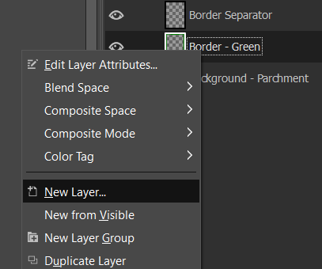
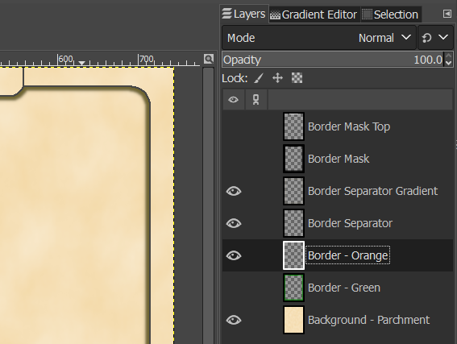
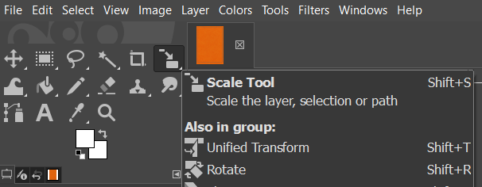
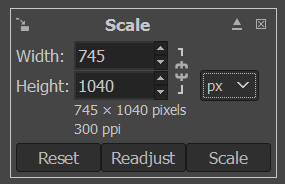
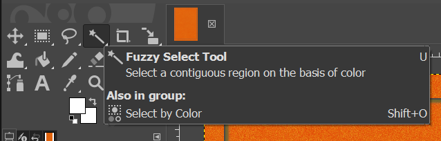
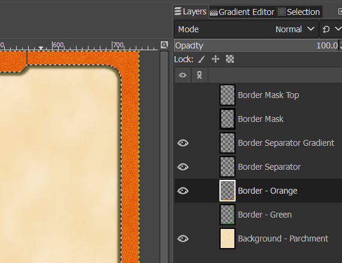
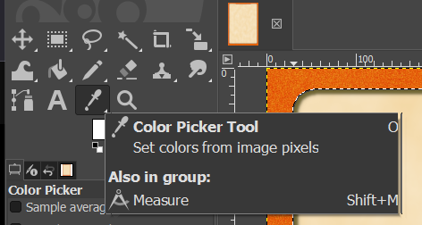
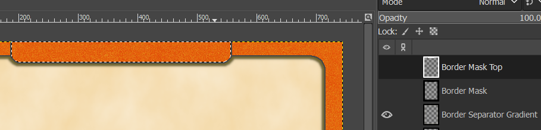
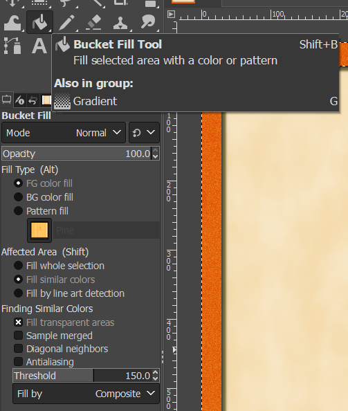
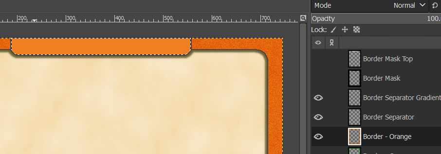

## Creating new Card Templates (Optional)

A collection of card templates are included in this repo. The various color borders have been created by using noise filters. The parchment background has been created by following [this tutorial](https://hmturnbull.com/fantasy-writing/maps/parchment-gimp/).

If you want to create your own templates, it is possible. I have included the .xcf file which I've used which can be re-used by anyone, though it does involve some basic image manipulation in [Gimp](https://www.gimp.org/).

You will need to have the image ready that you want to use as the template's background. Whether that image is one you have created yourself or found somewhere is up to you. It should be 745x1040 px, or have a similar ratio which can be resized, or be a image that can be cut without losing the visuals you want in the template.

Once you have your image ready, follow the steps below to create a template from it.

### Creating a new Template

1. Open the .xcf file in Gimp
2. Right-click the "Border - Green" layer and select "New layer"

    

3. Name the new layer whatever you wish ("Border - color_name" is my preferred way). This will create an empty layer in the correct placement.
4. Make sure only the following 4 layers are visible: "Background - Parchment", the newly created layer ("Border - Orange" in this example), "Border Separator", and "Border Separator Gradient". You should only see a the parchment with a lines and a bit of shading.

    

5. Paste or drag/drop your image onto the new layer, then resize it using the Scale Tool. You can click anywhere in the image to bring up a prompt where you can type the dimensions you want. You might have to merge the image down onto the "Border - Orange" layer, if the image you imported created a new layer.

    
    
    

6. Next, select the "Border Mask" layer (_do not unhide it_) and select the Fuzzy Select Tool

    .

7. Click in the middle of the image where the parchment will be in the end.
8. Select the "Border - Orange" layer again and press the delete key on your keyboard to reveal the parchment background.

    

9. Select the Color Picker Tool and click a color you want at the top of the template. Usually a lighter color is better.

    

10. Select the "Border Mask Top" layer (_do not unhide it_), select the Fuzzy Select Tool, and click the top section of the of the template.

    

11. Select the "Border - Orange" layer, then select the Bucket Fill Tool. Set the Opacity to 100 and the Threshold to something high (150 is usually enough).

    

12. With the bucket tool, click the the area you selected in step #10 to turn it into a solid color.

    

13. Go to `File -> Export As`, name the file `Card_Template_NAME.png` (replacing `NAME` with what you want to call the template) and Export it to the same folder as the other templates.

14. Go to the Google Sheet with your card data, click the Validations tab, and type the name (what you wrote instead of `NAME` in step 13) in an empty spot under "Card Templates". You can now select the template in the sheet, and Nandeck should be able to locate and use the file automatically.
